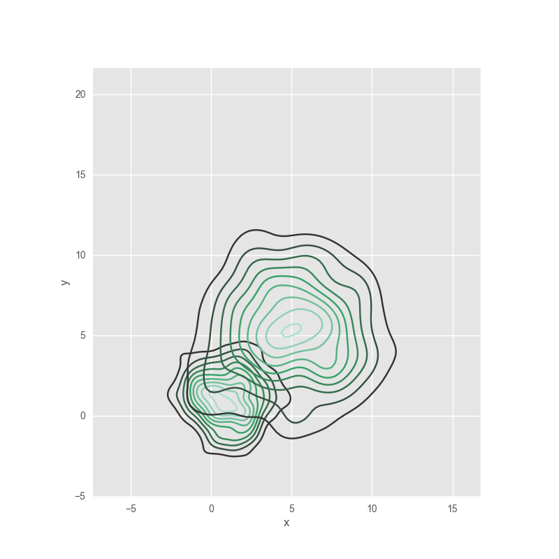
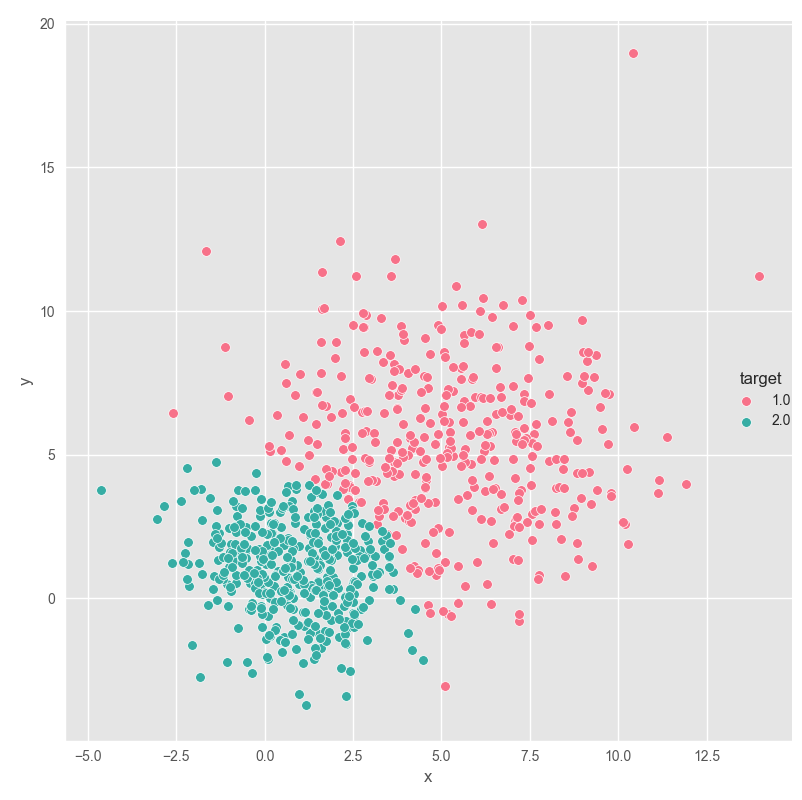
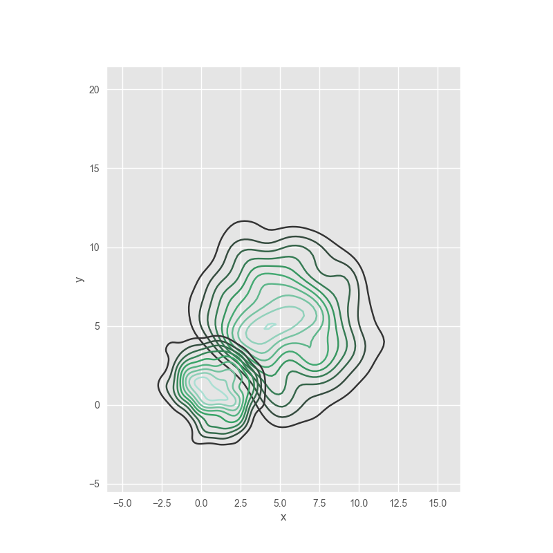
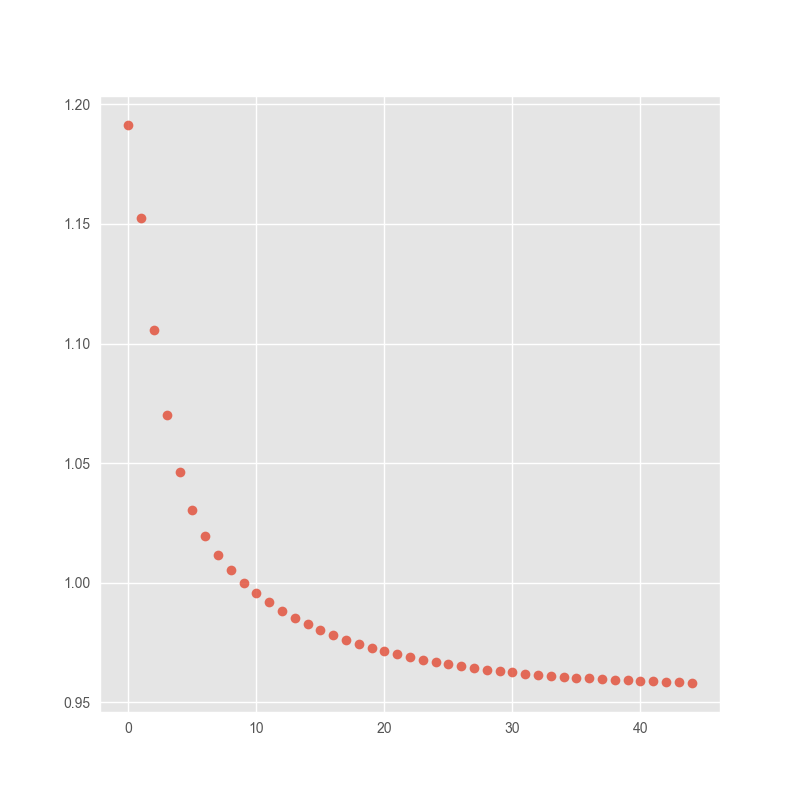

### Machine Learning assignment \#3 - Problem \#5

#### requierments:
+ python 3.6
+ numpy 1.12.0
+ matplotlib 2.0.0
+ pandas 0.19.2
+ seaborn 0.7.1

after running `main.py` script for first time, it will generate points

### actual points:

#### visualization in 2D space

#### distribution plot

### predicted data using EM
#### visualization in 2D space

#### distribution plot

### Means variation

#### class \#1

#### class \#2

